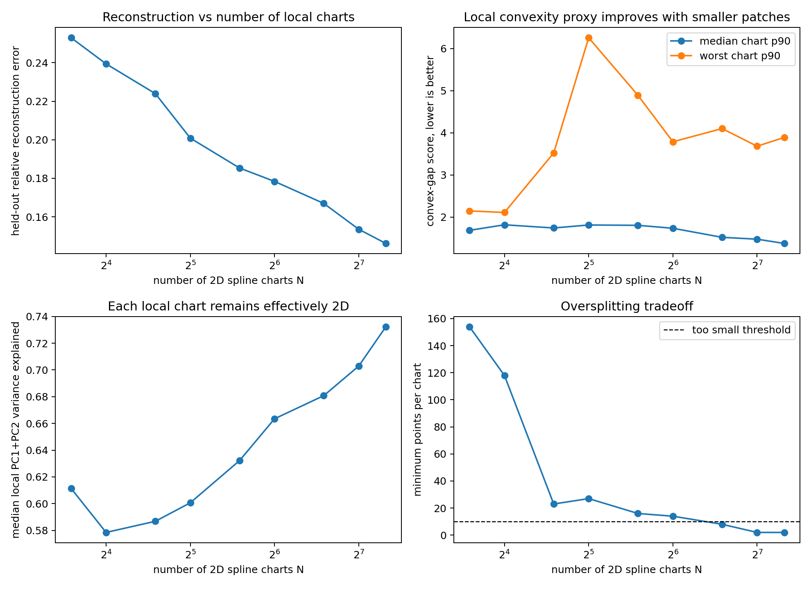

# Convex Local Spline Refinement

This extends the previous spline experiment by fixing the latent dimension at `K=2` and increasing the number of local spline charts up to `N=160`.

The word "convex" is operationalized here as local convex chart domains: each spline is fitted on one KMeans patch, the patch is represented in its own 2D PCA coordinates, and the decoded visualization uses the convex hull of that local 2D domain. I also measured a convex-gap proxy: random convex combinations of points in a chart should land near actual chart points if the patch is locally filled and convex-like. This is not a formal proof that the 64D image of the spline is a convex set.

## Main Numbers

- Best held-out reconstruction in this sweep: `N=160`, `K=2`, relative error `0.1462`, variance explained `0.9786`.
- Lowest median convex-gap score: `N=160`, p90 convex-gap `1.376`, min chart size `2`.
- Largest non-tiny tiling: `N=64`, min chart size `14`, median local PC1+PC2 variance `0.6635`, held-out relative error `0.1784`.

## Interpretation

Increasing `N` makes the chart patches smaller and more locally convex-like, but eventually oversplits the data. The useful picture is therefore not "one globally convex surface"; it is a continuous country-positive band/sheet that can be tiled by many local 2D convex domains. The local PC1+PC2 variance stays high across the sweep, so the effective dimension remains about 2 even as the number of spline patches increases.
