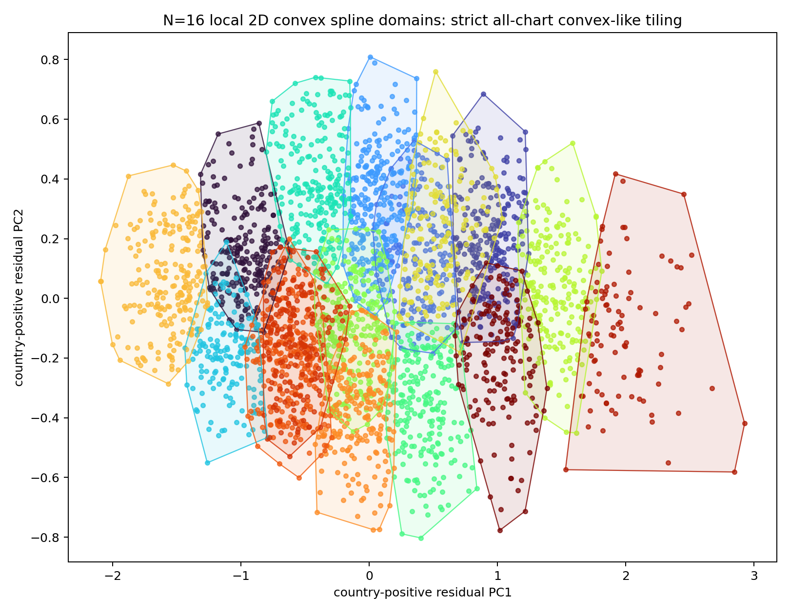
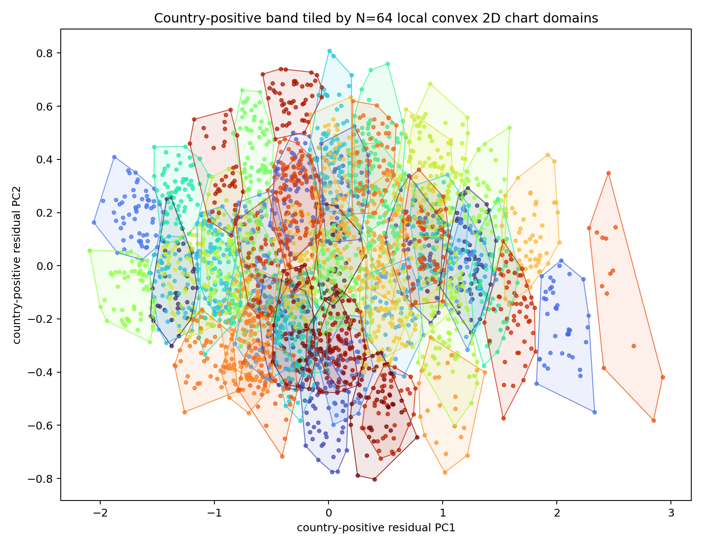

# Convex Spline Refinement Takeaway

Increasing the number of 2D spline charts improves held-out reconstruction, reaching relative error `0.1462` / variance explained `0.9786` at `N=160`. However, the strict all-chart convexity proxy is best treated separately from reconstruction: the largest tested setting where every chart has max p90 convex-gap <= `2.2`, max bad convex-combo fraction <= `0.05`, and at least 10 points per chart is `N=16`.

The `N=16` plot is the safest illustration if the claim is that each local spline patch is convex-like:

The `N=64` plot is better for showing a finer tiling of the band, but it has a few pathological patches under the strict proxy:

Conclusion: the country-positive residual set is not one convex object. It is better described as a nonlinear 2D band/sheet that can be covered by multiple local convex 2D spline domains; `N=16` is the clean all-convex-like cover from this sweep, while larger `N` improves reconstruction at the cost of oversplitting.
