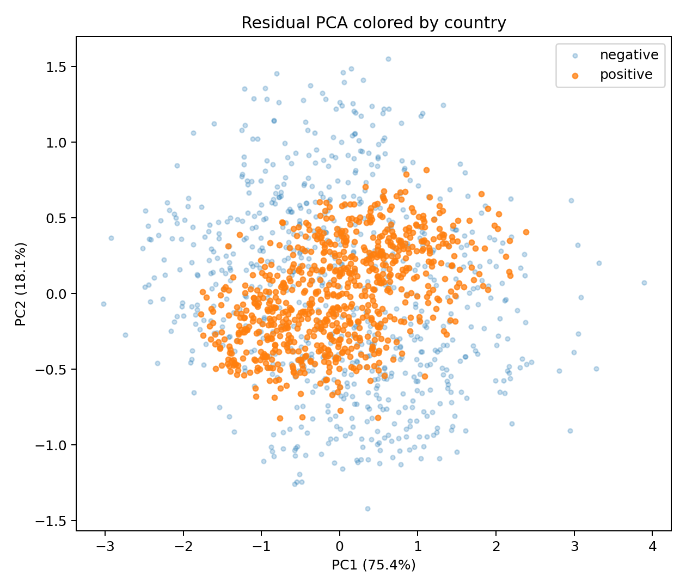
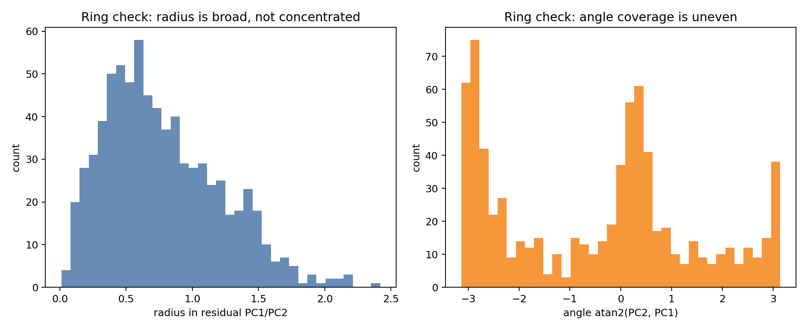
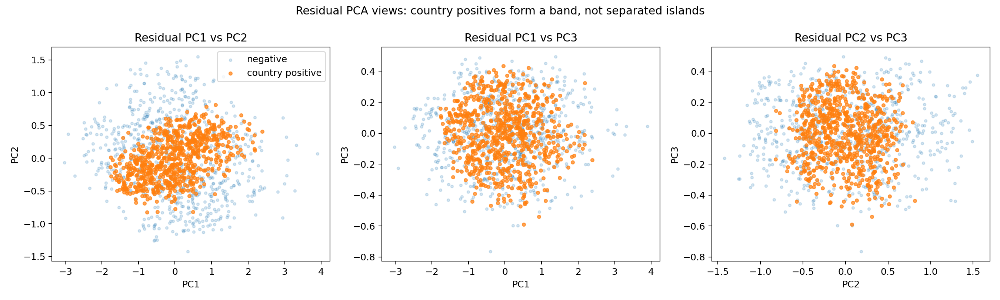
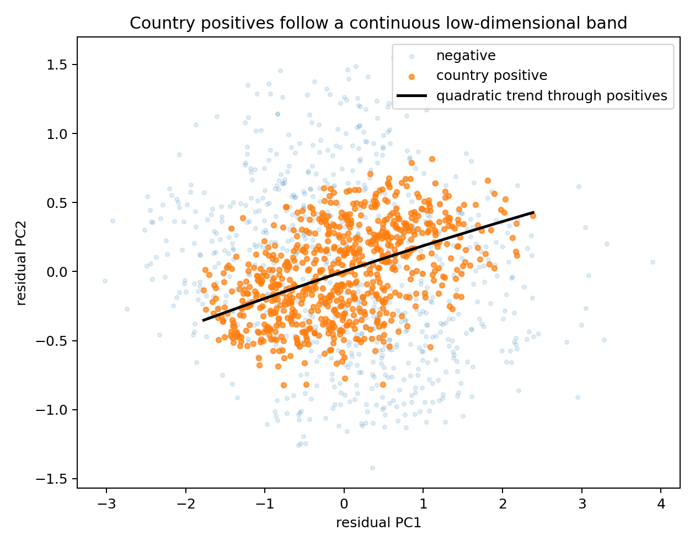
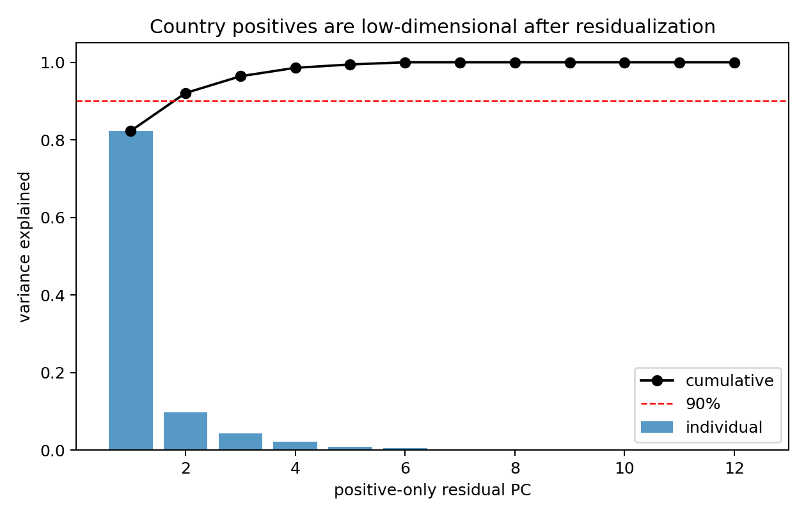

# Geometry of the Nonlinear `country` Representation

## Short Claim

The nonlinear feature is **country**. It is not represented by one global linear direction at layer L. Instead, after projecting out the seven linear feature directions, the `country` positives occupy a **low-dimensional nonlinear band-like region** inside the residual activation space.

## Why This Is Not a Ring

A ring-like code would usually look like points arranged around an empty center, with positives having a relatively concentrated radius and broad angular coverage. That is not what appears here. In residual PC1/PC2 space, the positives form a slanted dense region rather than wrapping around a hole.

The radius/angle diagnostics also argue against a clean ring. The radius is broad rather than concentrated: mean radius is `0.776`, standard deviation is `0.436`, and coefficient of variation is `0.562`. The angle histogram is uneven rather than showing smooth coverage around a circle.

## Why This Is Not Clearly Disconnected Clusters

The positives also do not look like clearly separated islands. Across several residual PCA views, the `country` positives occupy a mostly continuous cloud or band, with no stable empty gaps splitting them into obvious disconnected components.

Quick clustering diagnostics are also weak rather than decisive. KMeans silhouettes on the first three residual PCs are only moderate and decline as the number of clusters increases:

| clustering check | result |
| --- | --- |
| KMeans k=2 silhouette | 0.4518 |
| KMeans k=3 silhouette | 0.3867 |
| KMeans k=4 silhouette | 0.3328 |
| KMeans k=5 silhouette | 0.3418 |
| KMeans k=6 silhouette | 0.3133 |

DBSCAN also does not support a stable many-cluster interpretation. At very small radius it mostly labels points as noise; at reasonable radii it collapses to one cluster:

| DBSCAN eps | clusters | noise fraction |
| --- | --- | --- |
| 0.10 | 3 | 0.962 |
| 0.15 | 8 | 0.421 |
| 0.20 | 1 | 0.091 |
| 0.25 | 1 | 0.025 |
| 0.30 | 1 | 0.009 |
| 0.40 | 1 | 0.003 |

So the evidence does not justify saying the representation is a union of disconnected clusters.

## Why “Low-Dimensional Nonlinear Band” Is the Safer Description

After residualizing out the seven linearly represented features, the `country` positives are still organized in a structured way. They concentrate along a continuous slanted band in the first two residual PCs.

Positive-only PCA gives the strongest evidence for low dimensionality:

| PC | individual variance explained | cumulative variance explained |
| --- | --- | --- |
| 1 | 0.8228 | 0.8228 |
| 2 | 0.0979 | 0.9207 |
| 3 | 0.0433 | 0.9640 |
| 4 | 0.0217 | 0.9857 |
| 5 | 0.0086 | 0.9943 |
| 6 | 0.0057 | 1.0000 |

The first two PCs explain about **92.1%** of the positive residual variance, and only **2 PCs** are needed to exceed 90%. The participation ratio is **1.45**, which is also consistent with a low-dimensional structure.

This is why the cautious geometric interpretation is:

> The `country` representation is manifold-like: locally low-dimensional and not captured by a single global linear direction. It appears as a continuous low-dimensional band or tube in residual activation space, rather than a clean ring or a set of disconnected clusters.

## Connection to Probe Results

This geometry explains the probe results. A linear probe fails because membership in this residual band is not equivalent to thresholding one direction. But nonlinear probes can recover the feature because they can detect whether a point lies in or near this structured region.

| probe | country test performance |
| --- | --- |
| Linear probe | 0.4693 accuracy / 0.4903 AUROC |
| Mean-difference direction | 0.6080 best-threshold accuracy / 0.5081 AUROC |
| kNN k=3 | 0.9513 accuracy |
| kNN k=5 | 0.9500 accuracy |
| RBF SVM C=10 | 0.9647 accuracy |
| Model downstream head from layer L | 0.9640 accuracy / 0.9938 AUROC |

The key point is that the information is present at layer L, but it is organized nonlinearly. A single hyperplane does not decode `country`, while local or curved decision rules do.
