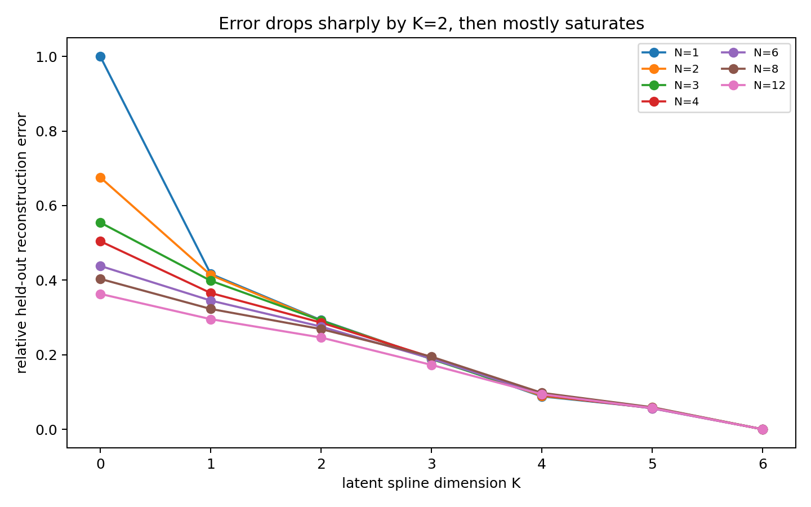
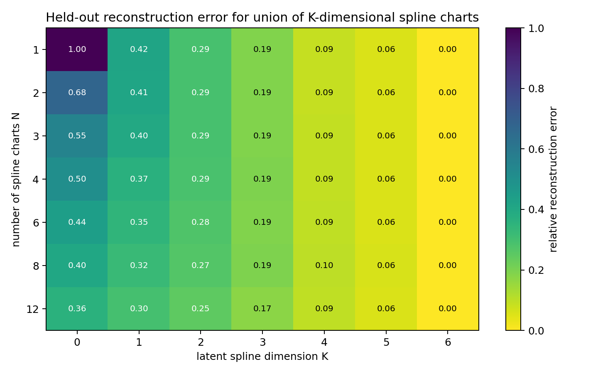

# Estimating the Dimension of the `country` Geometry with K-Dimensional Spline Charts

## Goal

We want to test whether the `country` positives in residual activation space are better described as a low-dimensional geometric object. To do this, I fit a union of spline-like charts where:

- `N` = number of local spline charts.
- `K` = latent dimension of each spline chart.
- Each chart maps from a `K`-dimensional PCA coordinate system back into the 64D residual activation space using an RBF spline decoder.

The experiment varies both `N` and `K`, then measures held-out reconstruction error on `country` positive examples.

## Method

1. Compute layer-L activations.
2. Remove the seven linearly represented feature directions.
3. Keep only `country` positive residual activations.
4. Split positives into fit and validation subsets.
5. For each `N`, cluster the fit positives into `N` local charts.
6. For each chart and each dimension `K`, fit a spline-like decoder from local `K`-dimensional PCA coordinates back to residual activation space.
7. Evaluate reconstruction error on held-out positives.

This is an intrinsic-dimension-style diagnostic: if increasing `K` sharply reduces held-out reconstruction error until some elbow, that elbow is evidence for the effective dimension.

## Results

The main result is that reconstruction improves sharply from `K=0` to `K=1`, improves again at `K=2`, and then continues improving more gradually. By `K=2`, the spline charts already explain roughly **91-94%** of the held-out positive residual variance depending on `N`.

The heatmap shows the same pattern. Increasing the number of charts `N` helps most when `K` is very small, but increasing the latent dimension `K` is the dominant effect.

## Important Nuance: Effective Dimension vs Exact Rank

There are two defensible readings:

1. **Effective dimension: `K ≈ 2`**. If we use a 90% variance/reconstruction threshold, `K=2` is enough. This matches the earlier positive-only PCA result where the first two residual PCs explain about 92.1% of positive variance.
2. **Exact low-rank dimension: `K = 6`**. The residualized `country` positives are numerically contained in an approximately 6-dimensional subspace, so `K=6` reconstructs almost exactly. This should not be interpreted as the semantic manifold necessarily being 6-dimensional; it is partly an artifact of measuring exact reconstruction in the model's residual activation subspace.

For the writeup, the safest wording is:

> The `country` positives are effectively low-dimensional. A 2D spline-like chart captures over 90% of the residual positive geometry, while exact reconstruction requires up to about 6 dimensions. Thus the visual/manifold evidence supports a low-dimensional nonlinear band or sheet, with effective dimension around 2 under a 90% criterion.

## Selected Grid Values

| N_splines | K_dim | relative_error | variance_explained |
| --- | --- | --- | --- |
| 1 | 1 | 0.4167 | 0.8263 |
| 1 | 2 | 0.2927 | 0.9143 |
| 1 | 3 | 0.1905 | 0.9637 |
| 1 | 4 | 0.0881 | 0.9922 |
| 6 | 1 | 0.3452 | 0.8808 |
| 6 | 2 | 0.2754 | 0.9242 |
| 6 | 3 | 0.1894 | 0.9641 |
| 6 | 4 | 0.0947 | 0.9910 |
| 12 | 1 | 0.2954 | 0.9127 |
| 12 | 2 | 0.2461 | 0.9394 |
| 12 | 3 | 0.1727 | 0.9702 |
| 12 | 4 | 0.0938 | 0.9912 |

## Interpretation

This supports the earlier geometry claim. The `country` feature is not a single linear direction, but its positives are not arbitrary high-dimensional scatter either. They lie near a structured low-dimensional region: approximately 2D for coarse/effective reconstruction, and up to 6D for exact reconstruction in this residualized representation.

## Caveat

This is not a formal proof of intrinsic manifold dimension. The spline charts use PCA coordinates plus RBF spline decoders, so the result is a practical reconstruction diagnostic. It is still useful evidence because the same held-out procedure was run across multiple values of `N` and `K`, and the low-dimensional structure is stable across the grid.
