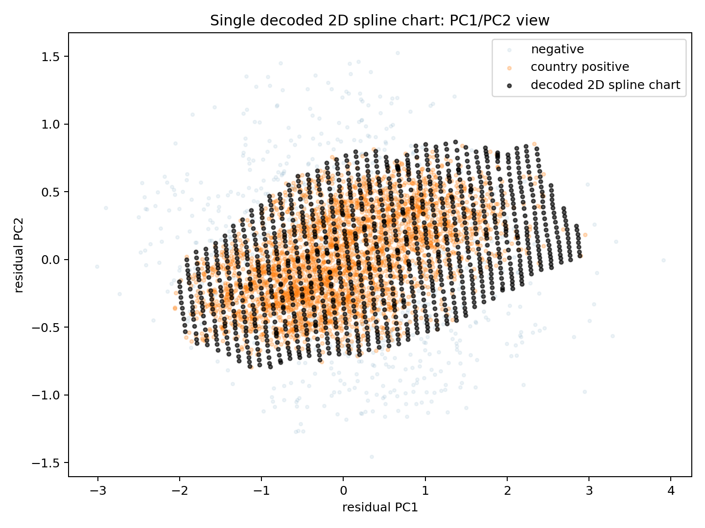
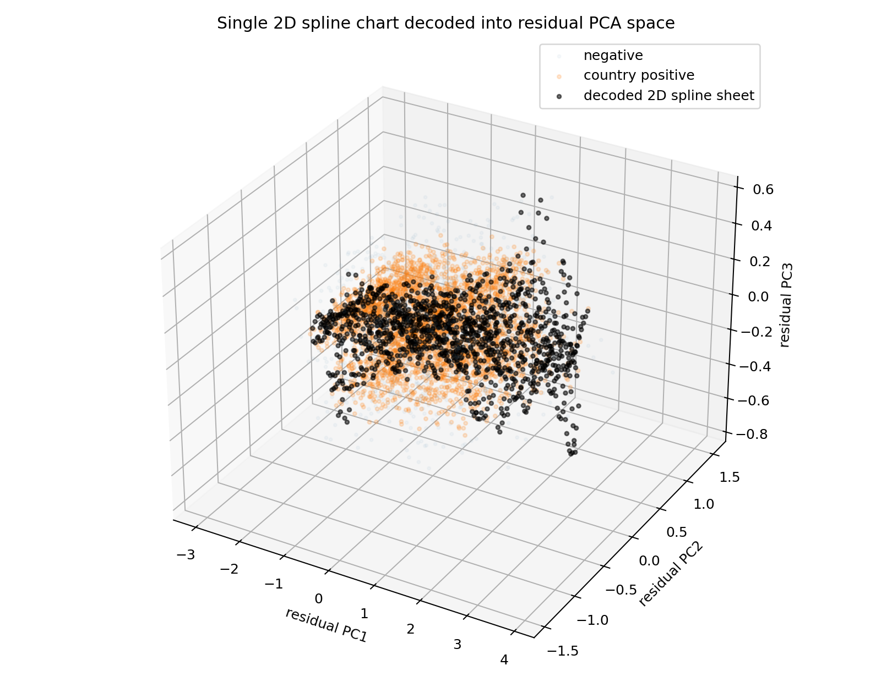
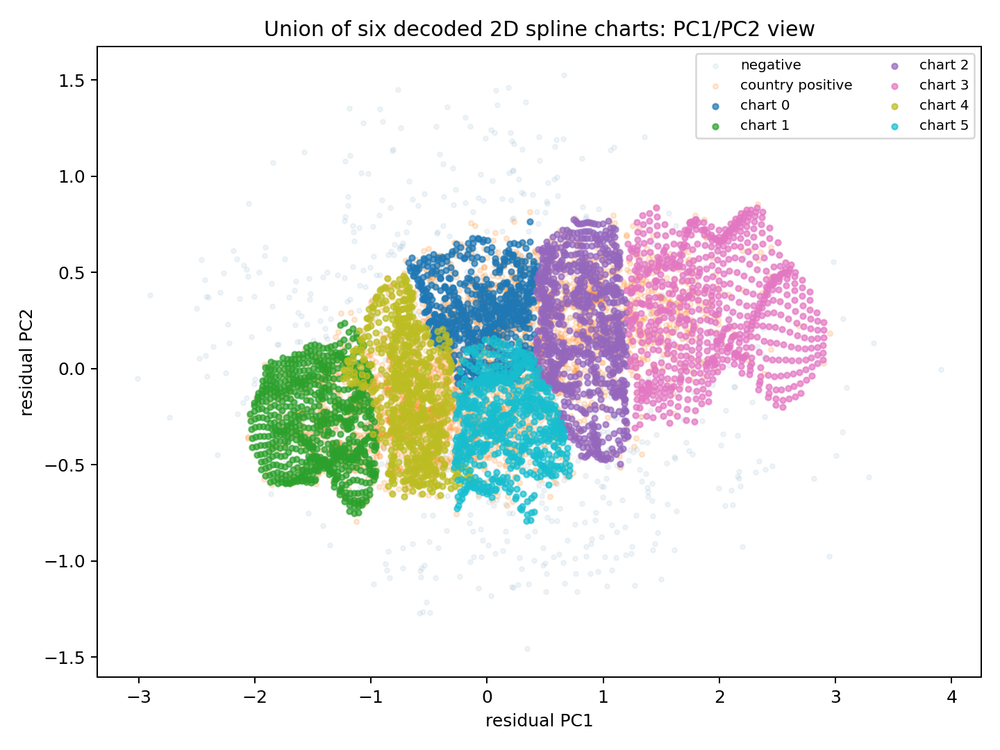
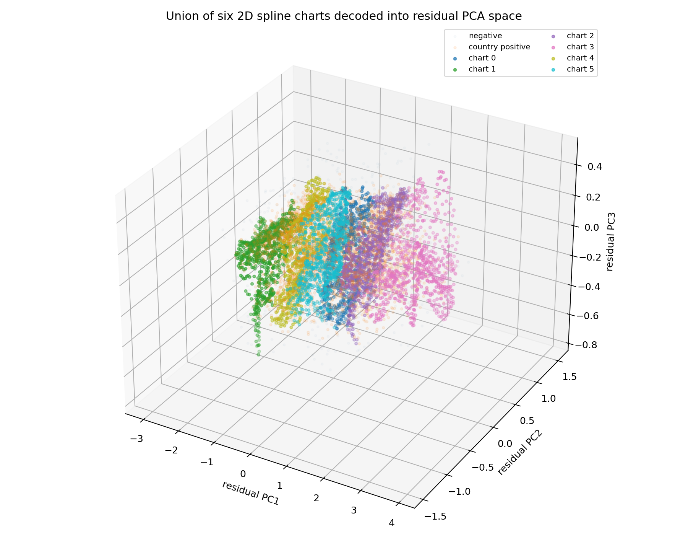
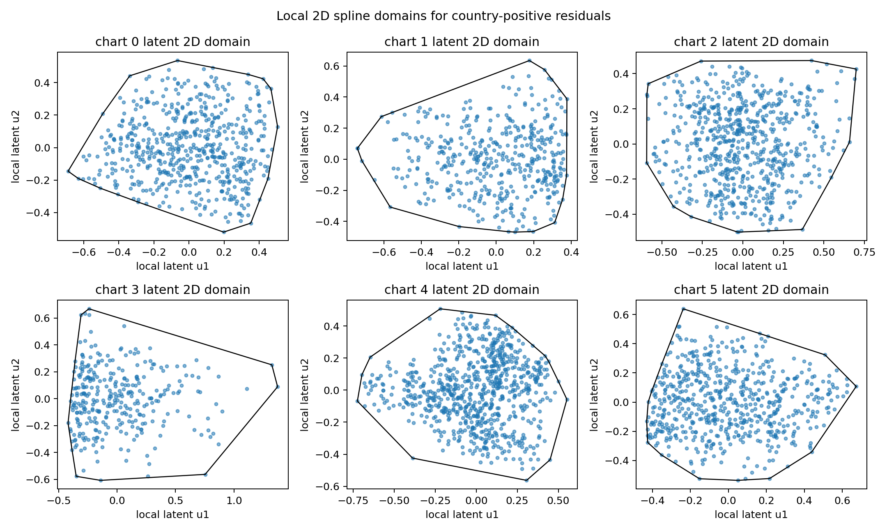

# Visualizing the 2D Spline Shape for `country`

These plots fit 2D spline-like charts to the `country` positive residual activations, decode grids from each chart back into the 64D residual activation space, then project the decoded points into global residual PCA coordinates for visualization.

## Single-Chart View

A single 2D chart gives a rough global sheet/band through the positives:

## Multi-Chart View

A union of six 2D charts captures local variation better. The charts tile a continuous band-like region rather than forming a clean circle or obviously disconnected islands:

## Local Latent Domains

Each chart has its own 2D latent PCA domain. Decoding these domains back into residual space gives the colored chart patches above:

## Interpretation

This is only a projection of a 64D object, not a literal surface in 3D. Still, it shows the practical shape implied by the K=2 spline model: a low-dimensional band/sheet running through the country-positive region. The six-chart version is the better visual model because it allows local patches to bend and vary while staying effectively 2D.
